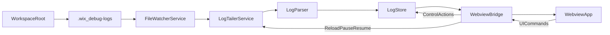

# Wix Debug Logs Extension Implementation Plan

## Architecture Overview

### Runtime Model

- **Extension host (Node/TypeScript):** file watching, tailing, parsing, buffering, filter/search indexing support, and message bridge.
- **Webview UI (TypeScript + React):** terminal-like rendering, virtualization, controls, search navigation/highlighting, follow-tail UX.
- **Recommended panel type:** `WebviewViewProvider` registered under a custom view container (plus command to reveal), because it supports rich terminal-like UI and virtualization better than tree/custom views.

### Activation & Entry Points

- Use activation events:
  - `onCommand:wixDebugLogs.openPanel`
  - `workspaceContains:.wix`
- Entrypoint in extension host:
  - `activate(context)` in `/Users/yasafv/Repos/wix_log_panel/src/extension.ts`
- Register:
  - command `wixDebugLogs.openPanel`
  - webview view provider `wixDebugLogs.view`
  - core services (watcher/tailer/parser/store) lifecycle with `context.subscriptions`.

### Component/Service Breakdown

- **`DebugLogsController`**: orchestrates app lifecycle and cross-service wiring.
- **`WorkspaceLogLocator`**: resolves workspace root and `.wix/debug-logs` path; reports empty-state reasons.
- **`FileWatcherService`**: watches `.wix/debug-logs/*` (top-level only) for create/change/delete with debounce.
- **`LogTailerService`**: per-file offset tracking, chunk reads, line framing, truncation/rotation handling.
- **`LogParser`**: parse standard line format with graceful fallback to unknown.
- **`LogStore`**: in-memory ring buffer, producer catalog, pause/follow flags, search/filter cache metadata.
- **`WebviewBridge`**: typed host<->webview message protocol.
- **`WebviewApp`**: controls bar + virtualized log list + match navigation/highlight.

### Data Flow



### Why Webview + React + Virtualization

- Multi-select controls, live streaming, search highlighting, and next/prev navigation are easier and cleaner in a webview.
- Custom tree/list APIs in core VS Code are not ideal for 200 lines/sec + rich highlighting.
- React + `react-window` (or `@tanstack/virtual-core`) gives predictable performance for ~10k rows.
- Keep host and UI isolated via typed protocol to reduce regressions.

## Proposed Project Structure

- `/Users/yasafv/Repos/wix_log_panel/package.json`: contributes (`commands`, `viewsContainers`, `views`, activation, config).
- `/Users/yasafv/Repos/wix_log_panel/src/extension.ts`: activation and service bootstrapping.
- `/Users/yasafv/Repos/wix_log_panel/src/core/types.ts`: shared domain/message types.
- `/Users/yasafv/Repos/wix_log_panel/src/core/logParser.ts`
- `/Users/yasafv/Repos/wix_log_panel/src/core/logTailer.ts`
- `/Users/yasafv/Repos/wix_log_panel/src/core/fileWatcher.ts`
- `/Users/yasafv/Repos/wix_log_panel/src/core/logStore.ts`
- `/Users/yasafv/Repos/wix_log_panel/src/webview/provider.ts`
- `/Users/yasafv/Repos/wix_log_panel/webview/src/App.tsx`
- `/Users/yasafv/Repos/wix_log_panel/webview/src/components/LogVirtualList.tsx`
- `/Users/yasafv/Repos/wix_log_panel/webview/src/components/ControlsBar.tsx`

## Implementation Epics and Ticket-Level Tasks

## Epic 1: Extension Scaffolding & Activation

- Add extension contributions:
  - command `Wix: Open Debug Logs Panel`
  - custom view container `Wix` and view `Wix Debug Logs`
  - settings: `wixDebugLogs.maxLines`, `wixDebugLogs.initialReadBytesPerFile`, `wixDebugLogs.readChunkBytes`.
- Build activation flow:
  - activate on `.wix` presence and command execution.
  - lazy-init webview assets when view opens.
- Add disposable lifecycle and error boundary logging (`OutputChannel` only, no log content telemetry).
- APIs/libraries:
  - VS Code: `window.registerWebviewViewProvider`, `commands.registerCommand`, `workspace.workspaceFolders`.
- Testing/integration:
  - smoke test activation and command reveals panel in Extension Test Host.

## Epic 2: Directory Watching & File Discovery

- Resolve workspace root and target dir `.wix/debug-logs`.
- Implement top-level file scan (ignore subdirectories).
- Watch directory create/delete/change events with debounce window (e.g. 50-100ms).
- Handle missing directory gracefully and keep re-checking/watch parent `.wix` for creation.
- APIs/libraries:
  - Node: `fs.promises.readdir`, `fs.promises.stat`, `fs.watch` (or `chokidar` if `fs.watch` proves unstable cross-platform).
  - VS Code optional: `workspace.createFileSystemWatcher` with `RelativePattern`.
- Testing/integration:
  - integration tests simulating create/write/delete under temp workspace.

## Epic 3: Tailing Engine + Parsing

- Implement per-file tail session with:
  - `offset`, `lastSize`, `leftoverPartialLine`, `inode/fingerprint` metadata.
- Initial attach:
  - seek from file end using configured bytes cap; parse only tail window.
- Incremental reads:
  - read appended bytes only; split by newline preserving incomplete trailing segment.
- Truncation/rotation handling:
  - if `newSize < offset`, reset offset to 0 (truncation).
  - if identity changed (inode/dev where available, else mtime+size heuristics), reopen from start/tail policy.
- Parse each full line into `LogEntry`, fallback to unknown on malformed lines.
- APIs/libraries:
  - Node: `fs.promises.open`, `FileHandle.read`, `fs.promises.stat`.
- Testing/integration:
  - unit tests for parser; tailer tests for append, partial lines, truncation, rotation.

## Epic 4: In-Memory State, Buffering & Throughput Control

- Implement bounded ring buffer (default 10k visible entries).
- Track producer set dynamically for filter options.
- Pause semantics:
  - continue reading in host; keep bounded buffer; UI visible list frozen until resume.
- Batch host->UI updates (e.g. every 33-100ms or N lines) to avoid message storm.
- Expose dropped-lines counter when cap exceeded.
- APIs/libraries:
  - internal queue + scheduler (`setTimeout`/`setImmediate`).
- Testing/integration:
  - perf-focused test harness generating ~200 lines/sec across ~10 files; assert no unbounded memory growth.

## Epic 5: Webview UI Skeleton + Virtualized Log List

- Set up webview bundling (`esbuild`/`vite`) and CSP-safe asset loading.
- Build terminal-like layout:
  - top controls bar
  - virtualized list area with monospace rendering and severity/producer styling.
- Implement follow-tail behavior:
  - auto-scroll only when user at/beyond bottom threshold.
  - explicit `Follow Tail` button to jump to latest.
- APIs/libraries:
  - React, `react-window` (fixed row height initially for perf/predictability).
- Testing/integration:
  - UI tests for follow-tail and rendering stability under burst updates.

## Epic 6: Filters, Search, and Control Actions

- Producer/level multi-select filters (default all selected).
- Case-insensitive substring search over buffered entries.
- Match highlight + next/prev navigation.
- Control actions:
  - Pause/Resume
  - Clear View (memory only)
  - Reload (re-run initial attach logic)
  - Follow Tail toggle/action.
- Optimization strategy:
  - maintain lightweight normalized text (`rawLower`) on ingest.
  - recompute filtered indices in memoized worker-like slices if needed.
- Testing/integration:
  - unit tests for filter combinatorics and search navigation correctness.

## Epic 7: Reliability, Empty States, and Hardening

- Empty states per PRD:
  - no workspace/.wix
  - waiting for `.wix/debug-logs`
  - directory exists but no files.
- Error handling:
  - per-file read failures isolated; watcher continues.
  - stale file handles cleaned on delete/rename.
- Performance hardening:
  - throttle expensive recompute during high throughput.
  - preserve UI responsiveness on resume from pause with chunked catch-up.
- Security/privacy:
  - guarantee no outbound network calls for log content.
- Testing/integration:
  - resilience tests around VS Code reload and folder transitions.

## TypeScript Interfaces and Contracts

```ts
export type LogLevel = 'error' | 'warn' | 'info' | 'debug' | 'unknown';

export interface LogEntry {
  id: string;                // monotonic unique id
  tsRaw?: string;            // original timestamp token
  timestamp?: number;        // epoch ms if parseable
  producer: string;
  level: LogLevel;
  message: string;
  raw: string;
  rawLower: string;          // cached lowercase for search
  sourceFile: string;
  ingestSeq: number;         // preserves arrival order
}

export interface TailFileState {
  filePath: string;
  offset: number;
  lastSize: number;
  leftover: string;          // partial trailing line between reads
  fileId?: string;           // inode/dev or synthetic fingerprint
  active: boolean;
}

export interface FilterState {
  producers: Set<string>;    // selected producers
  levels: Set<LogLevel>;     // selected levels
  query: string;
}

export interface ViewState {
  paused: boolean;
  followTail: boolean;
  droppedCount: number;
  maxLines: number;
}

export interface LogStoreState {
  entries: LogEntry[];       // bounded ring/array abstraction
  knownProducers: Set<string>;
  filters: FilterState;
  view: ViewState;
}
```

### Host <-> Webview Messages

```ts
export type HostToWebview =
  | { type: 'init'; payload: UiSnapshot }
  | { type: 'append'; payload: { entries: LogEntry[]; droppedCount: number } }
  | { type: 'state'; payload: Partial<UiSnapshot> }
  | { type: 'emptyState'; payload: { kind: 'noWorkspace' | 'noWix' | 'waitingLogsDir' | 'noFiles' } }
  | { type: 'error'; payload: { message: string } };

export type WebviewToHost =
  | { type: 'setProducerFilter'; payload: { producers: string[] } }
  | { type: 'setLevelFilter'; payload: { levels: LogLevel[] } }
  | { type: 'setQuery'; payload: { query: string } }
  | { type: 'togglePause' }
  | { type: 'clearView' }
  | { type: 'reload' }
  | { type: 'setFollowTail'; payload: { followTail: boolean } }
  | { type: 'searchNext' }
  | { type: 'searchPrev' };
```

## Algorithmic Plan

### Tailing Algorithm

- On discover file:
  - `stat` -> determine `size`.
  - initial offset = `max(0, size - initialReadBytesPerFile)`.
  - read from offset to EOF in chunks; parse complete lines only.
- On change event:
  - enqueue file in debounced scheduler.
  - `stat` and compare with `TailFileState.offset`.
  - if size increased: read `[offset, size)`.
  - if size decreased: mark truncation, reset `offset=0`, clear `leftover`, read from start (bounded by policy if desired).
- Rotation detection:
  - compare file fingerprint (`ino`/`dev` when available from `stat`) or fallback (`ctimeMs` jump + size pattern).
  - if rotated, reset state and attach to new file identity.
- Prevent rereads:
  - persist offset after each successful chunk parse.

### Virtualized Rendering

- Use fixed row height (first pass) for O(visibleRows) DOM nodes.
- Keep only visible + overscan rows mounted.
- Track whether viewport is at bottom threshold; apply follow-tail auto-scroll only in that state.
- On large append bursts:
  - append to data store once per frame/tick.
  - avoid forcing sync layout after each line.

### Filtering + Search Efficiency

- Maintain master bounded buffer in host.
- Apply filters to generate `visibleIndices` (or filtered ids) with incremental recompute on:
  - new batch append
  - filter/query changes.
- Search:
  - case-insensitive substring on `rawLower`.
  - maintain match index array for next/prev navigation.
- For pause/resume:
  - while paused, host keeps ingesting; UI list not updated.
  - on resume, deliver snapshot in chunks (e.g. 1k lines/tick) to avoid freeze.

## Performance and Reliability Strategy

- **Throughput protection:** event debounce + read batching + bridge batching.
- **Memory cap:** bounded entries (default 10k); drop oldest and increment `droppedCount` indicator.
- **UI jank prevention:** virtualization + chunked resume + avoid full re-filter on every single line.
- **Missing folders/files:** explicit empty states, watcher survives missing path and reattaches.
- **Reload resilience:** on extension activation, reconstruct watchers/tail states from filesystem only (no persistence required).
- **Privacy:** no outbound upload of log messages; only local rendering.

## Milestones and Acceptance Criteria

## Milestone 1: MVP Core (Tail + Panel)

- Deliverables:
  - panel opens via command/view
  - `.wix/debug-logs` watcher for top-level files
  - tailing + parsing + basic colorized rendering
  - follow-tail terminal behavior.
- Acceptance criteria:
  - appended lines appear within <500ms under normal load
  - malformed lines still visible with `unknown` producer/level
  - deleting a file stops its updates without extension crash.

## Milestone 2: Filters/Search/Controls

- Deliverables:
  - producer + level multi-select filters
  - case-insensitive search with highlight and next/prev
  - pause/resume, clear view, reload, follow-tail control.
- Acceptance criteria:
  - filter/search interactions complete in ~150ms on ~10k lines
  - clear does not mutate log files
  - pause/resume preserves continuity and avoids UI freeze.

## Milestone 3: Hardening and NFR Validation

- Deliverables:
  - truncation/rotation handling
  - performance tuning for 10 files / 200 lines-sec
  - complete empty states and robust error handling.
- Acceptance criteria:
  - sustained run shows no visible UI jank and bounded memory
  - truncation/rotation does not duplicate or corrupt stream semantics
  - VS Code reload recovers monitoring automatically.

## Risks and Open Technical Questions

- `fs.watch` behavior can vary by platform; may need fallback to `chokidar` for stability.
- Strict global time-ordering across producers is ambiguous if timestamps missing/unparseable; propose ingest order fallback.
- Initial history cap defaults are unresolved; recommend start with `maxLines=10000`, `initialReadBytesPerFile=256KB` and expose settings.
- Pause semantics in PRD open questions: plan assumes continue ingest + bounded buffer while paused.
- Producer color customization can be deferred to v2 to keep MVP scope tight.
